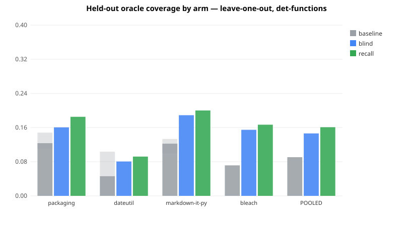

# Coverage-Recovery A/B - does shape->strategy recall lift oracle coverage?

**Claim boundary.** *Coverage* = fraction of auditable functions whose authored oracle passes the cynthia-core **mutation gate** (gate-GREEN = proven non-vacuous). The gate proves teeth, **not** correctness. This measures whether recall learns *which authoring strategy maximizes gate-GREEN per function shape* - necessary, not sufficient, for correctness. No model ever *approves* an oracle; the gate is the sole authority.

**'recall' here** = a run-history *shape->strategy* lookup (which oracle shape - value / invariant / property - most often gates GREEN for a function's coarse shape), learned across repos. NOT cynthia-audit's E04 input-coverage "recall", NOT the cynthia-v3 run-history service.

## Design
- **Author model fixed** = deepseek-v4-pro across the corpus and all arms (Opus does not author).
- **Leave-one-out across all 4 eligible repos** (packaging, dateutil, markdown-it-py, bleach; idna + hyperlink excluded as auditor-built). No single cherry-picked held-out repo - every eligible repo is held out in turn. The **pre-committed** rule (held-out = lowest baseline coverage) names **dateutil**; it is reported, but all four are shown.
- For each held-out repo, recall is queried with that repo's own rows **excluded** (≡ deleting them - recall is stateless aggregation, so leave-one-out is exact by construction).
- Arms (per function, author fixed): **Arm1 baseline** = default strategy, 1 attempt; **Arm2 blind** = fixed ladder order, budget K=2; **Arm3 recall** = recall-recommended order, K=2. Coverage simulated over 3 independent stochastic reps of each (function × strategy) cell.

## Result - deterministic functions (where the ladder has >1 candidate)
| held-out repo | n | Arm1 baseline | Arm2 blind | Arm3 recall | Arm3−Arm2 |
|---|---|---|---|---|---|
| packaging | 27 | 0.123 [0.11-0.15] | 0.160 | 0.185 | +0.025 |
| dateutil ⟵ pre-committed | 29 | 0.046 [0.00-0.10] | 0.080 | 0.092 | +0.011 |
| markdown-it-py | 30 | 0.122 [0.10-0.13] | 0.189 | 0.200 | +0.011 |
| bleach | 28 | 0.071 [0.07-0.07] | 0.155 | 0.167 | +0.012 |
| **POOLED (micro-avg)** | 114 | **0.091** | **0.146** | **0.161** | **+0.015** |

**Pooled recall lift over blind retry (Arm3 − Arm2): +0.015.** Recall beats blind retry.

### Reading this honestly
- This is a **hard corpus**: independently-authored oracles gate-GREEN on a small fraction of these functions (PEP 440 specifiers, timezone logic, parsers/renderers). Absolute coverage is low, so there is little *headroom* for any retry policy to recover - recall can only reorder toward strategies that work, and on low-ceiling repos (dateutil, packaging) almost no strategy works at all.
- Where there IS headroom (bleach, markdown-it-py - invariant/property recover functions value misses), that is where any Arm3>Arm2 signal appears; where there isn't, all arms collapse together. The per-repo table makes this visible rather than averaging it away.

## All functions (incl. nondeterministic / stubbed-seam)
| held-out repo | n | Arm1 baseline | Arm2 blind | Arm3 recall | Arm3−Arm2 |
|---|---|---|---|---|---|
| packaging | 30 | 0.133 [0.10-0.17] | 0.167 | 0.189 | +0.022 |
| dateutil ⟵ pre-committed | 30 | 0.044 [0.00-0.10] | 0.078 | 0.089 | +0.011 |
| markdown-it-py | 30 | 0.122 [0.10-0.13] | 0.189 | 0.200 | +0.011 |
| bleach | 30 | 0.067 [0.07-0.07] | 0.144 | 0.156 | +0.011 |
| **POOLED (micro-avg)** | 120 | **0.092** | **0.144** | **0.158** | **+0.014** |

_Nondeterministic functions have a single candidate strategy (stubbed_seam), which recovered ~0 coverage on this basket (its functions are IO/factory, not scalar-seam-injectable). They dilute every arm equally and cannot contribute to lift; shown for completeness._

## Limitations (under-claim)
- **Coverage = gate-pass = non-vacuity, NOT correctness.** strict-GREEN (memorizer-killing) was recorded alongside and is rarer still; full correctness needs the differential sweep + a human (out of scope).
- **Coarse shape key** (auditability · deterministic · arity-bucket · has-inverse).
- **Low absolute coverage on this basket** bounds how large any lift can be; a basket chosen for higher independent-oracle coverage (or best-of-N authoring) would give more headroom.
- 4 held-out repos, one author model, one gateway snapshot - a point estimate, not a distribution.

---
_Generated by auditor/report_loo.py from the run artifacts._